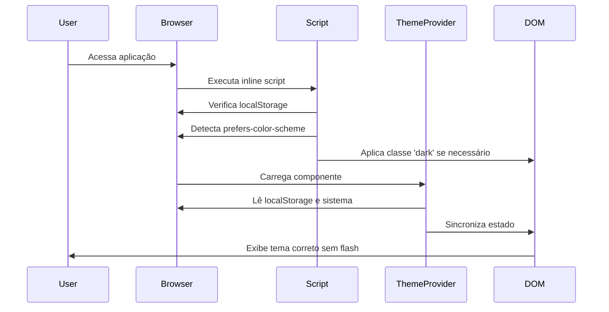
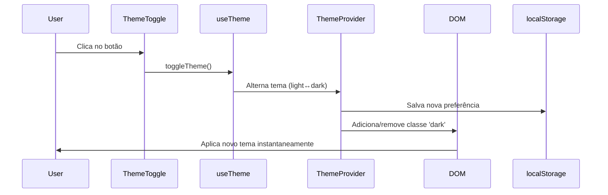
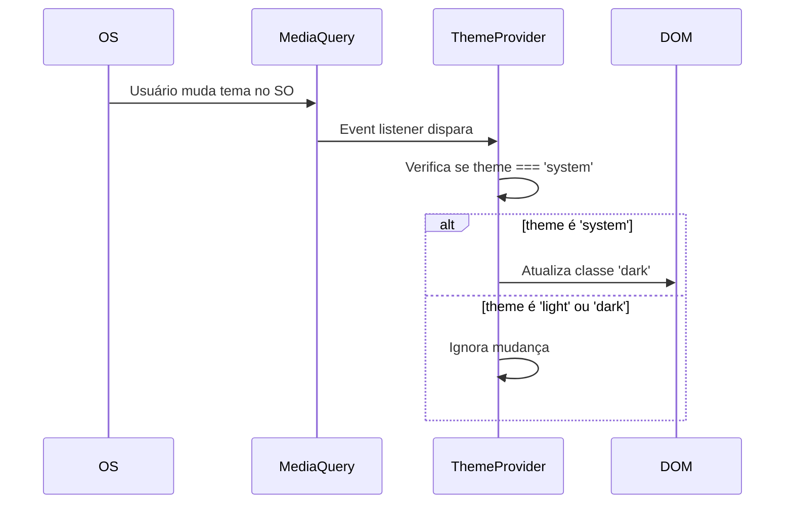

# Planejamento: Sistema de Switch Mode (Dark/Light Theme)

## Índice
1. [Visão Geral](#visão-geral)
2. [Análise da Estrutura Atual](#análise-da-estrutura-atual)
3. [Arquitetura Proposta](#arquitetura-proposta)
4. [Especificação Técnica Detalhada](#especificação-técnica-detalhada)
5. [Fluxo de Funcionamento](#fluxo-de-funcionamento)
6. [Implementação Passo a Passo](#implementação-passo-a-passo)
7. [Considerações de UX/UI](#considerações-de-uxui)
8. [Testes e Validação](#testes-e-validação)
9. [Possíveis Problemas e Soluções](#possíveis-problemas-e-soluções)

---

## Visão Geral

### Objetivo
Implementar um sistema completo de alternância entre temas claro e escuro que:
- Detecta automaticamente a preferência do sistema operacional (Windows, macOS, Linux, iOS, Android)
- Permite alternância manual via toggle UI
- Persiste a preferência do usuário
- Funciona de forma consistente em desktop e mobile
- Evita flash de conteúdo não estilizado (FOUC - Flash of Unstyled Content)
- Integra-se perfeitamente com a arquitetura Next.js 15 existente

### Escopo
- ✅ Detecção automática de tema do sistema
- ✅ Toggle manual de tema
- ✅ Persistência em localStorage
- ✅ Prevenção de FOUC em SSR
- ✅ Integração visual no header
- ✅ Suporte completo mobile e desktop
- ✅ Animações suaves de transição
- ✅ Acessibilidade (ARIA labels, keyboard navigation)

---

## Análise da Estrutura Atual

### Estado Atual da Aplicação

#### 1. Tailwind CSS Configuration
**Arquivo**: `tailwind.config.js`

```javascript
darkMode: ['class']  // ✅ Já configurado para class-based dark mode
```

**Comportamento**:
- Dark mode ativado quando a classe `dark` é aplicada ao elemento `<html>`
- Requer manipulação manual da classe para alternar temas
- Suporte a media queries para fallback: `@media (prefers-color-scheme: dark)`

#### 2. CSS Variables (Design System)
**Arquivo**: `src/app/globals.css`

**Status**: ✅ **COMPLETAMENTE IMPLEMENTADO**

```css
/* Light Mode */
:root {
  --background: 0 0% 98%;
  --foreground: 220 13% 18%;
  --primary: 270 70% 65%;
  /* ... todas as variáveis definidas */
}

/* Dark Mode */
.dark {
  --background: 220 15% 6%;
  --foreground: 220 14% 96%;
  --primary: 270 70% 65%;
  /* ... todas as variáveis ajustadas para dark mode */
}
```

**Análise**:
- Sistema de cores HSL completo
- Suporte a cores primárias, secundárias, accents
- Variáveis de chart (5 cores)
- Soft colors (blue, purple, green, orange, pink)
- Border, input, ring, muted, popover variants
- **Nenhuma alteração necessária** - apenas precisa ativar via classe

#### 3. Estrutura de Providers
**Arquivo**: `src/app/layout.tsx`

```tsx
export default function RootLayout({ children }: { children: React.ReactNode }) {
  return (
    <html lang="pt-BR">
      <body className={`${inter.className} antialiased`}>
        <Providers>
          <HeaderNavigation />
          {children}
          <ConditionalBottomNavigation items={navigationItems} />
          <Toaster />
        </Providers>
      </body>
    </html>
  );
}
```

**Arquivo**: `src/providers/SessionProvider.tsx`

```tsx
"use client";

import { SessionProvider as NextAuthSessionProvider } from "next-auth/react";

export function Providers({ children }: { children: React.ReactNode }) {
  return (
    <NextAuthSessionProvider>
      {children}
    </NextAuthSessionProvider>
  );
}
```

**Análise**:
- Provider structure já estabelecida
- Apenas `SessionProvider` atualmente
- Precisa adicionar `ThemeProvider` no wrapper
- Componente já marcado como `"use client"`

#### 4. Header Navigation
**Arquivo**: `src/components/HeaderNavigation.tsx`

**Estrutura Atual**:
```tsx
// Desktop Header
<NotificationBell /> {/* Já implementado */}
<ChatBell />         {/* Já implementado */}
// [ESPAÇO PARA ThemeToggle]
<Avatar />
<MenuNavigation />

// Mobile Header
<Avatar + MenuNavigation (Hamburger) />
```

**Análise**:
- Espaço ideal: Lado direito, entre ChatBell e Avatar
- Mobile: Pode ser incluído no MenuNavigation ou como botão separado
- Já usa CSS variables (compatível com dark mode)

---

## Arquitetura Proposta

### Visão Geral da Arquitetura

```
┌─────────────────────────────────────────────────────────────┐
│                        HTML Element                          │
│                    <html class="dark">                       │
└──────────────────────────┬──────────────────────────────────┘
                           │
                           │ Theme class applied
                           │
┌──────────────────────────▼──────────────────────────────────┐
│                      ThemeProvider                           │
│  - Detects system preference (prefers-color-scheme)         │
│  - Reads localStorage for saved preference                  │
│  - Provides theme state and toggle function                 │
│  - Applies 'dark' class to <html> element                   │
│  - Listens to system theme changes                          │
└──────────────────────────┬──────────────────────────────────┘
                           │
                           │ Provides context
                           │
┌──────────────────────────▼──────────────────────────────────┐
│                      ThemeContext                            │
│  - Current theme: 'light' | 'dark' | 'system'               │
│  - toggleTheme() function                                    │
│  - setTheme(theme) function                                  │
│  - resolvedTheme: 'light' | 'dark' (actual applied theme)  │
└──────────────────────────┬──────────────────────────────────┘
                           │
                           │ Consumed by
                           │
┌──────────────────────────▼──────────────────────────────────┐
│                        useTheme()                            │
│  Custom hook to access theme context                        │
└──────────────────────────┬──────────────────────────────────┘
                           │
                           │ Used in
                           │
┌──────────────────────────▼──────────────────────────────────┐
│                      ThemeToggle                             │
│  - Button with Sun/Moon icons                               │
│  - Smooth animations                                         │
│  - Accessible (ARIA labels)                                  │
│  - Calls toggleTheme()                                       │
└──────────────────────────┬──────────────────────────────────┘
                           │
                           │ Placed in
                           │
┌──────────────────────────▼──────────────────────────────────┐
│                   HeaderNavigation                           │
│  NotificationBell | ChatBell | ThemeToggle | Avatar         │
└─────────────────────────────────────────────────────────────┘
```

### Estrutura de Arquivos

```
src/
├── contexts/
│   └── ThemeContext.tsx              [NEW]
│       - Define ThemeContext
│       - Export ThemeContextProvider
│
├── providers/
│   ├── SessionProvider.tsx            [UPDATE]
│   │   - Wrap children with ThemeProvider
│   │
│   └── ThemeProvider.tsx              [NEW]
│       - Main theme logic
│       - System detection
│       - localStorage persistence
│       - HTML class manipulation
│
├── hooks/
│   └── useTheme.ts                    [NEW]
│       - Custom hook for theme access
│       - Returns { theme, setTheme, toggleTheme, resolvedTheme }
│
├── components/
│   ├── ThemeToggle.tsx                [NEW]
│   │   - Toggle button component
│   │   - Sun/Moon icons
│   │   - Animations
│   │
│   └── HeaderNavigation.tsx           [UPDATE]
│       - Add ThemeToggle integration
│
└── lib/
    └── theme.ts                       [NEW - OPTIONAL]
        - Theme utility functions
        - Constants and types
```

---

## Especificação Técnica Detalhada

### 1. ThemeContext (`src/contexts/ThemeContext.tsx`)

**Responsabilidade**: Definir o contrato de interface do contexto de tema

```typescript
"use client";

import { createContext } from "react";

export type Theme = "light" | "dark" | "system";
export type ResolvedTheme = "light" | "dark";

export interface ThemeContextValue {
  theme: Theme;                           // Preferência do usuário
  resolvedTheme: ResolvedTheme;           // Tema efetivamente aplicado
  setTheme: (theme: Theme) => void;       // Define tema manualmente
  toggleTheme: () => void;                // Alterna entre light/dark
}

export const ThemeContext = createContext<ThemeContextValue | undefined>(undefined);
```

**Tipos**:
- `Theme`: Preferência do usuário ("light", "dark", "system")
- `ResolvedTheme`: Tema real aplicado ("light" ou "dark")
- `ThemeContextValue`: Interface completa do contexto

---

### 2. ThemeProvider (`src/providers/ThemeProvider.tsx`)

**Responsabilidade**: Lógica principal do sistema de tema

#### Funcionalidades

**A. Detecção de Preferência Inicial**
```typescript
// Ordem de prioridade:
// 1. localStorage (se existir)
// 2. System preference (prefers-color-scheme)
// 3. Fallback para 'light'

const getInitialTheme = (): Theme => {
  if (typeof window === "undefined") return "light";

  const stored = localStorage.getItem("theme");
  if (stored === "light" || stored === "dark" || stored === "system") {
    return stored;
  }

  return "system"; // Default para seguir o sistema
};
```

**B. Resolução de Tema**
```typescript
// Se theme === "system", resolve para light/dark baseado no sistema
// Caso contrário, retorna o tema escolhido

const getResolvedTheme = (theme: Theme): ResolvedTheme => {
  if (theme !== "system") return theme;

  if (typeof window === "undefined") return "light";

  return window.matchMedia("(prefers-color-scheme: dark)").matches
    ? "dark"
    : "light";
};
```

**C. Aplicação do Tema ao DOM**
```typescript
// Aplica a classe 'dark' ao elemento <html>
// Remove a classe se o tema for 'light'

useEffect(() => {
  const root = document.documentElement;
  const resolved = getResolvedTheme(theme);

  if (resolved === "dark") {
    root.classList.add("dark");
  } else {
    root.classList.remove("dark");
  }
}, [theme, systemTheme]);
```

**D. Listener de Mudanças no Sistema**
```typescript
// Detecta quando o usuário muda o tema no SO
// Atualiza automaticamente se theme === "system"

useEffect(() => {
  const mediaQuery = window.matchMedia("(prefers-color-scheme: dark)");

  const handleChange = (e: MediaQueryListEvent) => {
    if (theme === "system") {
      setSystemTheme(e.matches ? "dark" : "light");
    }
  };

  mediaQuery.addEventListener("change", handleChange);
  return () => mediaQuery.removeEventListener("change", handleChange);
}, [theme]);
```

**E. Persistência em localStorage**
```typescript
// Salva a preferência sempre que mudar

useEffect(() => {
  localStorage.setItem("theme", theme);
}, [theme]);
```

**F. Prevenção de FOUC (Flash of Unstyled Content)**
```typescript
// Script inline no <head> que executa ANTES da renderização
// Garante que a classe 'dark' seja aplicada antes do primeiro paint

// Este script será adicionado via <Script strategy="beforeInteractive">
// ou inline no layout.tsx
```

#### Implementação Completa

```typescript
"use client";

import React, { createContext, useContext, useEffect, useState } from "react";

type Theme = "light" | "dark" | "system";
type ResolvedTheme = "light" | "dark";

interface ThemeContextValue {
  theme: Theme;
  resolvedTheme: ResolvedTheme;
  setTheme: (theme: Theme) => void;
  toggleTheme: () => void;
}

const ThemeContext = createContext<ThemeContextValue | undefined>(undefined);

export function ThemeProvider({ children }: { children: React.ReactNode }) {
  const [theme, setThemeState] = useState<Theme>("light");
  const [systemTheme, setSystemTheme] = useState<ResolvedTheme>("light");
  const [mounted, setMounted] = useState(false);

  // Inicialização do tema
  useEffect(() => {
    setMounted(true);

    // Detecta preferência do sistema
    const mediaQuery = window.matchMedia("(prefers-color-scheme: dark)");
    setSystemTheme(mediaQuery.matches ? "dark" : "light");

    // Carrega preferência salva
    const stored = localStorage.getItem("theme") as Theme | null;
    if (stored === "light" || stored === "dark" || stored === "system") {
      setThemeState(stored);
    } else {
      setThemeState("system"); // Default
    }
  }, []);

  // Listener de mudanças no sistema
  useEffect(() => {
    if (!mounted) return;

    const mediaQuery = window.matchMedia("(prefers-color-scheme: dark)");

    const handleChange = (e: MediaQueryListEvent) => {
      setSystemTheme(e.matches ? "dark" : "light");
    };

    mediaQuery.addEventListener("change", handleChange);
    return () => mediaQuery.removeEventListener("change", handleChange);
  }, [mounted]);

  // Resolução do tema efetivo
  const resolvedTheme: ResolvedTheme =
    theme === "system" ? systemTheme : theme;

  // Aplicação do tema ao DOM
  useEffect(() => {
    if (!mounted) return;

    const root = document.documentElement;

    if (resolvedTheme === "dark") {
      root.classList.add("dark");
    } else {
      root.classList.remove("dark");
    }
  }, [resolvedTheme, mounted]);

  // Persistência
  useEffect(() => {
    if (!mounted) return;
    localStorage.setItem("theme", theme);
  }, [theme, mounted]);

  // Funções de controle
  const setTheme = (newTheme: Theme) => {
    setThemeState(newTheme);
  };

  const toggleTheme = () => {
    setThemeState((prev) => {
      // Se está em system, vai para light ou dark baseado no atual
      if (prev === "system") {
        return systemTheme === "dark" ? "light" : "dark";
      }
      // Alterna entre light e dark
      return prev === "dark" ? "light" : "dark";
    });
  };

  // Evita hidratação mismatch
  if (!mounted) {
    return <>{children}</>;
  }

  return (
    <ThemeContext.Provider
      value={{
        theme,
        resolvedTheme,
        setTheme,
        toggleTheme,
      }}
    >
      {children}
    </ThemeContext.Provider>
  );
}

export function useTheme() {
  const context = useContext(ThemeContext);
  if (context === undefined) {
    throw new Error("useTheme must be used within a ThemeProvider");
  }
  return context;
}
```

---

### 3. Hook useTheme (`src/hooks/useTheme.ts`)

**Responsabilidade**: Facilitar acesso ao contexto de tema

```typescript
"use client";

import { useContext } from "react";
import { ThemeContext } from "@/contexts/ThemeContext";

export function useTheme() {
  const context = useContext(ThemeContext);

  if (context === undefined) {
    throw new Error("useTheme must be used within a ThemeProvider");
  }

  return context;
}
```

**Uso**:
```typescript
const { theme, resolvedTheme, setTheme, toggleTheme } = useTheme();

// Alternar tema
<button onClick={toggleTheme}>Toggle</button>

// Definir tema específico
<button onClick={() => setTheme("dark")}>Dark</button>
<button onClick={() => setTheme("light")}>Light</button>
<button onClick={() => setTheme("system")}>System</button>

// Verificar tema atual
{resolvedTheme === "dark" ? <MoonIcon /> : <SunIcon />}
```

---

### 4. Componente ThemeToggle (`src/components/ThemeToggle.tsx`)

**Responsabilidade**: UI para alternar entre temas

#### Requisitos de Design
- Botão com ícone de Sol (light) ou Lua (dark)
- Animação suave de transição
- Tooltip explicativo
- Acessível (ARIA labels, keyboard navigation)
- Responsivo (mobile e desktop)

#### Implementação

```typescript
"use client";

import { Moon, Sun } from "lucide-react";
import { useTheme } from "@/hooks/useTheme";
import { Button } from "@/components/ui/button";
import {
  Tooltip,
  TooltipContent,
  TooltipProvider,
  TooltipTrigger,
} from "@/components/ui/tooltip";

export function ThemeToggle() {
  const { resolvedTheme, toggleTheme } = useTheme();

  return (
    <TooltipProvider>
      <Tooltip>
        <TooltipTrigger asChild>
          <Button
            variant="ghost"
            size="icon"
            onClick={toggleTheme}
            aria-label={
              resolvedTheme === "dark"
                ? "Mudar para tema claro"
                : "Mudar para tema escuro"
            }
            className="relative h-9 w-9"
          >
            {/* Ícone com animação de rotação */}
            <Sun
              className={`h-5 w-5 transition-all duration-300 ${
                resolvedTheme === "dark"
                  ? "rotate-90 scale-0 opacity-0"
                  : "rotate-0 scale-100 opacity-100"
              }`}
            />
            <Moon
              className={`absolute h-5 w-5 transition-all duration-300 ${
                resolvedTheme === "dark"
                  ? "rotate-0 scale-100 opacity-100"
                  : "-rotate-90 scale-0 opacity-0"
              }`}
            />
          </Button>
        </TooltipTrigger>
        <TooltipContent>
          <p>
            {resolvedTheme === "dark"
              ? "Mudar para tema claro"
              : "Mudar para tema escuro"}
          </p>
        </TooltipContent>
      </Tooltip>
    </TooltipProvider>
  );
}
```

**Alternativa Simples (sem tooltip)**:
```typescript
"use client";

import { Moon, Sun } from "lucide-react";
import { useTheme } from "@/hooks/useTheme";
import { Button } from "@/components/ui/button";

export function ThemeToggle() {
  const { resolvedTheme, toggleTheme } = useTheme();

  return (
    <Button
      variant="ghost"
      size="icon"
      onClick={toggleTheme}
      aria-label="Alternar tema"
      className="relative h-9 w-9"
    >
      {resolvedTheme === "dark" ? (
        <Moon className="h-5 w-5 transition-transform duration-300 rotate-0" />
      ) : (
        <Sun className="h-5 w-5 transition-transform duration-300 rotate-0" />
      )}
    </Button>
  );
}
```

---

### 5. Integração no Header (`src/components/HeaderNavigation.tsx`)

#### Posicionamento

**Desktop**:
```tsx
// Antes (exemplo simplificado):
<div className="flex items-center gap-3">
  <NotificationBell />
  <ChatBell />
  {/* ADICIONAR AQUI */}
  <UserAvatar />
  <MenuNavigation />
</div>

// Depois:
<div className="flex items-center gap-3">
  <NotificationBell />
  <ChatBell />
  <ThemeToggle />  {/* NOVO */}
  <UserAvatar />
  <MenuNavigation />
</div>
```

**Mobile**:
Opção 1: Botão separado no header
```tsx
<div className="flex items-center gap-2">
  <ThemeToggle />
  <UserAvatar />
  <MenuNavigation />
</div>
```

Opção 2: Dentro do MenuNavigation
```tsx
// Adicionar item no menu
<NavigationMenuItem>
  <ThemeToggle />
</NavigationMenuItem>
```

---

### 6. Atualização do SessionProvider (`src/providers/SessionProvider.tsx`)

**Antes**:
```typescript
"use client";

import { SessionProvider as NextAuthSessionProvider } from "next-auth/react";

export function Providers({ children }: { children: React.ReactNode }) {
  return (
    <NextAuthSessionProvider>
      {children}
    </NextAuthSessionProvider>
  );
}
```

**Depois**:
```typescript
"use client";

import { SessionProvider as NextAuthSessionProvider } from "next-auth/react";
import { ThemeProvider } from "./ThemeProvider";

export function Providers({ children }: { children: React.ReactNode }) {
  return (
    <ThemeProvider>
      <NextAuthSessionProvider>
        {children}
      </NextAuthSessionProvider>
    </ThemeProvider>
  );
}
```

**Nota**: ThemeProvider deve envolver SessionProvider para estar disponível em toda a aplicação.

---

### 7. Prevenção de FOUC (Flash of Unstyled Content)

#### Problema
Durante SSR, o servidor não sabe a preferência de tema do cliente. Isso pode causar:
1. Página renderiza em light mode
2. JavaScript carrega e detecta dark mode
3. Página "pisca" ao trocar de tema

#### Solução: Script Inline no Layout

**Adicionar no `src/app/layout.tsx`**:

```typescript
export default function RootLayout({ children }: { children: React.ReactNode }) {
  return (
    <html lang="pt-BR" suppressHydrationWarning>
      <head>
        {/* Script executado ANTES da renderização */}
        <script
          dangerouslySetInnerHTML={{
            __html: `
              (function() {
                try {
                  var theme = localStorage.getItem('theme');
                  var systemDark = window.matchMedia('(prefers-color-scheme: dark)').matches;

                  if (theme === 'dark' || (theme === 'system' && systemDark) || (!theme && systemDark)) {
                    document.documentElement.classList.add('dark');
                  }
                } catch (e) {}
              })();
            `,
          }}
        />
      </head>
      <body className={`${inter.className} antialiased`}>
        <Providers>
          <HeaderNavigation />
          {children}
          <ConditionalBottomNavigation items={navigationItems} />
          <Toaster />
        </Providers>
      </body>
    </html>
  );
}
```

**O que faz**:
1. Executa IMEDIATAMENTE, antes do React hidratar
2. Lê `localStorage.theme`
3. Detecta preferência do sistema
4. Aplica classe `dark` se necessário
5. Evita flash visual

**Importante**: Adicionar `suppressHydrationWarning` ao `<html>` porque o script modifica a classe antes da hidratação.

---

## Fluxo de Funcionamento

### Inicialização (Primeira Visita)



### Alternância Manual



### Detecção de Mudança no Sistema



---

## Implementação Passo a Passo

### Fase 1: Criar Estrutura Base
**Duração estimada**: 30 minutos

#### Passo 1.1: Criar ThemeContext
```bash
docker compose exec app sh
```
```bash
mkdir -p src/contexts
touch src/contexts/ThemeContext.tsx
```

**Conteúdo**: [Ver especificação em "Especificação Técnica Detalhada > 1. ThemeContext"]

#### Passo 1.2: Criar ThemeProvider
```bash
touch src/providers/ThemeProvider.tsx
```

**Conteúdo**: [Ver especificação em "Especificação Técnica Detalhada > 2. ThemeProvider"]

#### Passo 1.3: Criar Hook useTheme
```bash
mkdir -p src/hooks
touch src/hooks/useTheme.ts
```

**Conteúdo**: [Ver especificação em "Especificação Técnica Detalhada > 3. Hook useTheme"]

---

### Fase 2: Criar Componente de UI
**Duração estimada**: 20 minutos

#### Passo 2.1: Criar ThemeToggle
```bash
touch src/components/ThemeToggle.tsx
```

**Conteúdo**: [Ver especificação em "Especificação Técnica Detalhada > 4. Componente ThemeToggle"]

#### Passo 2.2: Testar componente isolado
```tsx
// Temporariamente adicionar em qualquer página para testar
import { ThemeToggle } from "@/components/ThemeToggle";

export default function TestPage() {
  return (
    <div className="p-8">
      <ThemeToggle />
      <p className="mt-4 text-foreground">
        Teste de texto em tema {resolvedTheme}
      </p>
    </div>
  );
}
```

---

### Fase 3: Integração Global
**Duração estimada**: 30 minutos

#### Passo 3.1: Atualizar SessionProvider
```bash
# Editar src/providers/SessionProvider.tsx
```

**Mudanças**:
```typescript
import { ThemeProvider } from "./ThemeProvider";

export function Providers({ children }: { children: React.ReactNode }) {
  return (
    <ThemeProvider>
      <NextAuthSessionProvider>
        {children}
      </NextAuthSessionProvider>
    </ThemeProvider>
  );
}
```

#### Passo 3.2: Adicionar Script Anti-FOUC no Layout
```bash
# Editar src/app/layout.tsx
```

**Adicionar**:
```typescript
<html lang="pt-BR" suppressHydrationWarning>
  <head>
    <script dangerouslySetInnerHTML={{...}} />
  </head>
  ...
</html>
```

[Ver código completo em "Especificação Técnica Detalhada > 7. Prevenção de FOUC"]

#### Passo 3.3: Integrar ThemeToggle no Header
```bash
# Editar src/components/HeaderNavigation.tsx
```

**Adicionar importação**:
```typescript
import { ThemeToggle } from "@/components/ThemeToggle";
```

**Adicionar no JSX** (após ChatBell):
```tsx
<ThemeToggle />
```

---

### Fase 4: Testes e Validação
**Duração estimada**: 30 minutos

#### Passo 4.1: Testar Funcionalidades Básicas
```bash
docker compose up app
```

**Checklist**:
- [ ] Toggle alterna entre light e dark
- [ ] Preferência é salva no localStorage
- [ ] Página não "pisca" ao recarregar
- [ ] Tema correto aplicado na primeira visita
- [ ] Ícones animam suavemente

#### Passo 4.2: Testar Detecção de Sistema
**Procedimento**:
1. Limpar localStorage: `localStorage.removeItem('theme')`
2. Mudar tema do SO (Windows: Configurações > Personalização > Cores)
3. Recarregar página
4. Verificar se tema corresponde ao SO

**Checklist**:
- [ ] Dark mode do SO → Aplica dark theme
- [ ] Light mode do SO → Aplica light theme
- [ ] Mudança em tempo real (sem recarregar) funciona

#### Passo 4.3: Testar em Mobile
**Chrome DevTools**:
1. F12 → Toggle device toolbar (Ctrl+Shift+M)
2. Selecionar dispositivo móvel
3. Testar toggle no header
4. Verificar responsividade

**Checklist**:
- [ ] Toggle visível em mobile
- [ ] Animações funcionam
- [ ] Touch funciona corretamente
- [ ] Layout não quebra

#### Passo 4.4: Testar Acessibilidade
**Ferramentas**:
- Tab navigation
- Screen reader (NVDA/JAWS no Windows, VoiceOver no Mac)

**Checklist**:
- [ ] Botão acessível via Tab
- [ ] Enter/Space ativam o toggle
- [ ] ARIA labels corretos
- [ ] Focus visible

---

### Fase 5: Documentação e Finalização
**Duração estimada**: 20 minutos

#### Passo 5.1: Atualizar CLAUDE.md
Adicionar seção sobre o sistema de tema:

```markdown
### Theme System

**Location**: `/src/providers/ThemeProvider.tsx`, `/src/components/ThemeToggle.tsx`

**Overview**: Complete dark/light mode system with system detection and persistence.

**Features**:
- Auto-detection of OS theme preference
- Manual toggle via ThemeToggle button
- localStorage persistence
- FOUC prevention via inline script
- Real-time sync with system theme changes

**Usage**:
```typescript
const { theme, resolvedTheme, setTheme, toggleTheme } = useTheme();

// Toggle theme
<ThemeToggle />

// Set specific theme
setTheme("dark");
setTheme("light");
setTheme("system");
```

**Integration**: ThemeToggle is integrated in HeaderNavigation between ChatBell and UserAvatar.
```

#### Passo 5.2: Commit e Push
```bash
git add .
git commit -m "feat: implement complete dark/light theme system with OS detection

- Add ThemeProvider with system preference detection
- Create ThemeToggle component with smooth animations
- Integrate toggle in HeaderNavigation
- Add FOUC prevention script
- Persist theme preference in localStorage
- Support real-time OS theme changes

🤖 Generated with Claude Code"

git push -u origin claude/plan-switch-mode-architecture-011CUbSZmusNDeN5AVfZ3evV
```

---

## Considerações de UX/UI

### Animações

#### Transição de Tema
```css
/* Adicionar em globals.css */
* {
  transition: background-color 0.3s ease, color 0.3s ease, border-color 0.3s ease;
}

/* Desabilitar transição durante carregamento */
.no-transition * {
  transition: none !important;
}
```

**Aplicar temporariamente durante hidratação**:
```typescript
useEffect(() => {
  document.documentElement.classList.add('no-transition');
  setTimeout(() => {
    document.documentElement.classList.remove('no-transition');
  }, 0);
}, []);
```

#### Ícones do Toggle
- Rotação de 90° para suavidade
- Scale de 0 a 100% para fade in/out
- Duração: 300ms
- Timing: ease-in-out

### Posicionamento Visual

**Desktop**:
```
[Logo] ─────────── [Notif] [Chat] [Theme] [Avatar] [Menu]
```

**Mobile**:
```
[Avatar] [Menu]            ou          [Avatar] [Theme] [Menu]
  └─ Dropdown com Theme                (Theme como botão separado)
```

### Cores e Contraste

**Já implementado no globals.css**:
- Light mode: Background quase branco (98%), texto escuro (18%)
- Dark mode: Background escuro azulado (6%), texto claro (96%)
- Contraste WCAG AA compliant

---

## Testes e Validação

### Checklist Completo de Testes

#### Funcionalidades Básicas
- [ ] Toggle alterna entre light/dark
- [ ] Ícone muda (Sun ↔ Moon)
- [ ] Animação suave ao alternar
- [ ] Classes CSS aplicadas corretamente ao `<html>`
- [ ] Cores mudam em todos os componentes

#### Persistência
- [ ] Preferência salva no localStorage
- [ ] Após recarregar, tema permanece
- [ ] Após fechar e reabrir navegador, tema permanece
- [ ] localStorage atualiza ao alternar

#### Detecção de Sistema
- [ ] Primeira visita usa tema do SO
- [ ] Dark mode do SO → Dark theme aplicado
- [ ] Light mode do SO → Light theme aplicado
- [ ] Mudança em tempo real funciona (sem recarregar)

#### FOUC Prevention
- [ ] Sem flash na primeira visita
- [ ] Sem flash ao recarregar com dark mode
- [ ] Script inline executa antes da renderização
- [ ] Hidratação ocorre sem erros

#### Responsividade
- [ ] Toggle visível em desktop
- [ ] Toggle visível em mobile
- [ ] Toggle funciona em tablets
- [ ] Layout não quebra em telas pequenas

#### Acessibilidade
- [ ] Navegável via teclado (Tab)
- [ ] Ativável via Enter/Space
- [ ] ARIA labels corretos
- [ ] Focus visível
- [ ] Anúncio de mudança para screen readers

#### Integração
- [ ] Funciona com SessionProvider
- [ ] Não conflita com NextAuth
- [ ] Funciona em todas as páginas
- [ ] Funciona em rotas protegidas
- [ ] Funciona em páginas públicas

#### Performance
- [ ] Sem re-renders desnecessários
- [ ] Transições suaves (não travadas)
- [ ] localStorage não bloqueia UI
- [ ] Script inline minificado

---

## Possíveis Problemas e Soluções

### Problema 1: Flash de Conteúdo (FOUC)
**Sintoma**: Página "pisca" ao carregar, mostrando tema errado primeiro

**Causa**: Script JavaScript carrega após renderização inicial

**Solução**:
1. Adicionar script inline no `<head>` (antes do body)
2. Script executa ANTES do React hidratar
3. Adicionar `suppressHydrationWarning` ao `<html>`

```typescript
<html lang="pt-BR" suppressHydrationWarning>
```

---

### Problema 2: Hydration Mismatch
**Sintoma**: Console mostra erro "Text content did not match..."

**Causa**: Servidor renderiza diferente do cliente

**Solução**:
1. Não renderizar ThemeToggle até mounted:
```typescript
const [mounted, setMounted] = useState(false);
useEffect(() => setMounted(true), []);
if (!mounted) return null;
```

2. Ou retornar placeholder:
```typescript
if (!mounted) return <div className="h-9 w-9" />;
```

---

### Problema 3: localStorage não Funciona em SSR
**Sintoma**: Erro "localStorage is not defined"

**Causa**: localStorage não existe no servidor

**Solução**:
```typescript
const getStoredTheme = () => {
  if (typeof window === "undefined") return null;
  return localStorage.getItem("theme");
};
```

---

### Problema 4: Tema não Muda em Tempo Real
**Sintoma**: Precisa recarregar para ver mudanças

**Causa**: Falta listener de mudanças no sistema

**Solução**:
```typescript
useEffect(() => {
  const mediaQuery = window.matchMedia("(prefers-color-scheme: dark)");
  mediaQuery.addEventListener("change", handleChange);
  return () => mediaQuery.removeEventListener("change", handleChange);
}, []);
```

---

### Problema 5: Transições Muito Rápidas/Lentas
**Sintoma**: Mudança de tema brusca ou muito lenta

**Solução**:
Ajustar duração em `globals.css`:
```css
* {
  transition-duration: 200ms; /* Mais rápido */
  /* ou */
  transition-duration: 500ms; /* Mais lento */
}
```

---

### Problema 6: Alguns Componentes não Mudam de Tema
**Sintoma**: Partes da UI permanecem no tema antigo

**Causa**: Componentes usam cores hardcoded

**Solução**:
Substituir cores fixas por CSS variables:
```tsx
// ❌ Evitar
<div className="bg-white text-black">

// ✅ Usar
<div className="bg-background text-foreground">
```

---

## Melhorias Futuras (Fase 2)

### 1. Dropdown de Seleção
Em vez de toggle simples, adicionar dropdown com 3 opções:
- ☀️ Light
- 🌙 Dark
- 💻 System

### 2. Transições Customizadas
Permitir usuário escolher velocidade de transição:
- Rápido (100ms)
- Normal (300ms)
- Lento (500ms)
- Sem transição

### 3. Temas Customizados
Adicionar mais variações de cores:
- Dark Blue (atual)
- True Black (AMOLED)
- Warm Dark (tons amarelados)
- Cool Dark (tons azulados)

### 4. Persistência no Banco de Dados
Para usuários logados, salvar preferência no User model:
```prisma
model User {
  themePreference String? @default("system") // "light" | "dark" | "system"
}
```

### 5. Preferências Avançadas
- Auto dark mode por horário
- Dark mode apenas das 18h às 6h
- Geolocalização para sunrise/sunset

---

## Resumo de Arquivos a Criar/Modificar

### Criar (5 arquivos)
1. ✅ `src/contexts/ThemeContext.tsx`
2. ✅ `src/providers/ThemeProvider.tsx`
3. ✅ `src/hooks/useTheme.ts`
4. ✅ `src/components/ThemeToggle.tsx`
5. ✅ `docs/theme-switch-mode-planning.md` (este arquivo)

### Modificar (3 arquivos)
1. ✅ `src/providers/SessionProvider.tsx` - Adicionar ThemeProvider wrapper
2. ✅ `src/app/layout.tsx` - Adicionar script anti-FOUC e suppressHydrationWarning
3. ✅ `src/components/HeaderNavigation.tsx` - Integrar ThemeToggle

### Opcional (1 arquivo)
1. 🔶 `src/app/globals.css` - Adicionar transições suaves (opcional)

---

## Estimativa de Tempo

| Fase | Tarefa | Tempo Estimado |
|------|--------|----------------|
| 1 | Criar estrutura base (Context, Provider, Hook) | 30 min |
| 2 | Criar componente ThemeToggle | 20 min |
| 3 | Integração global (Layout, Header) | 30 min |
| 4 | Testes e validação | 30 min |
| 5 | Documentação e commit | 20 min |
| **Total** | | **~2 horas** |

---

## Conclusão

Este planejamento fornece uma arquitetura completa e profissional para implementação de um sistema de alternância de tema dark/light que:

✅ Detecta automaticamente o tema do sistema operacional
✅ Permite alternância manual via UI
✅ Persiste a preferência do usuário
✅ Evita flash visual durante carregamento
✅ Sincroniza em tempo real com mudanças no SO
✅ É totalmente acessível e responsivo
✅ Integra-se perfeitamente com a arquitetura Next.js 15 existente

A implementação é modular, testável, e segue as melhores práticas de desenvolvimento React/Next.js.

---

**Documento criado em**: 2025-10-29
**Versão**: 1.0
**Autor**: Claude Code (Anthropic)
**Projeto**: Barbershop Next - Sistema de Agendamento
