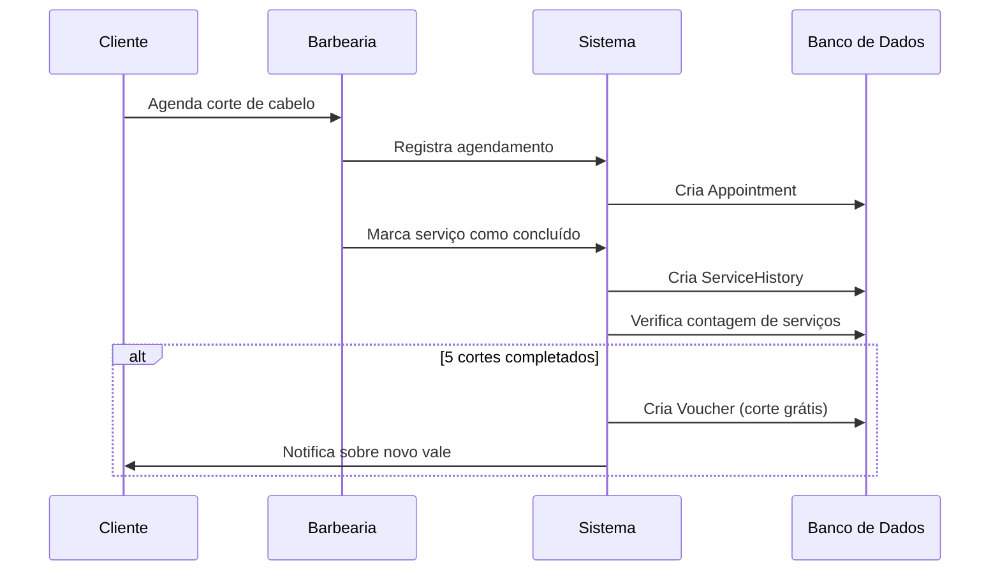
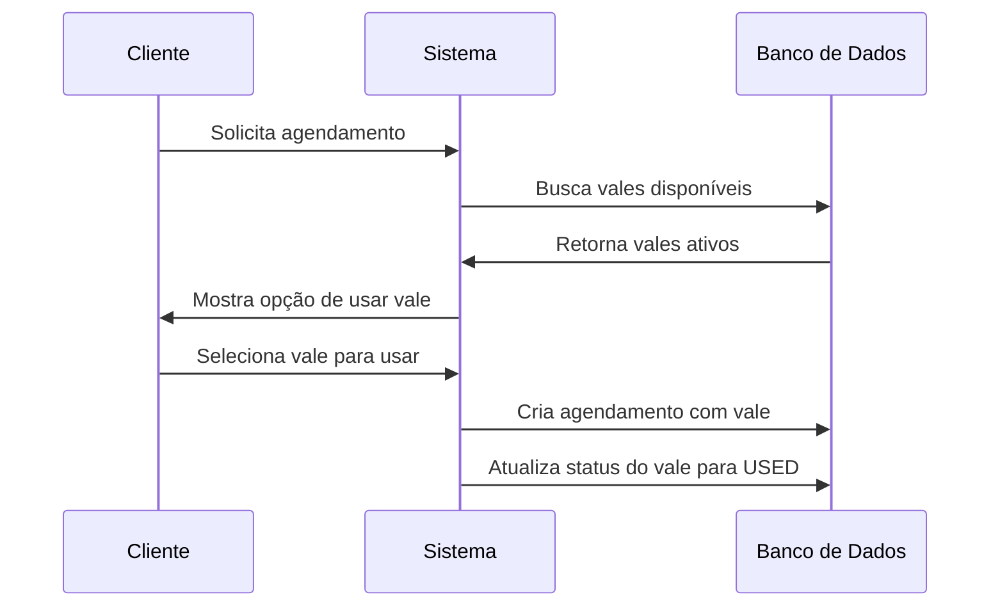
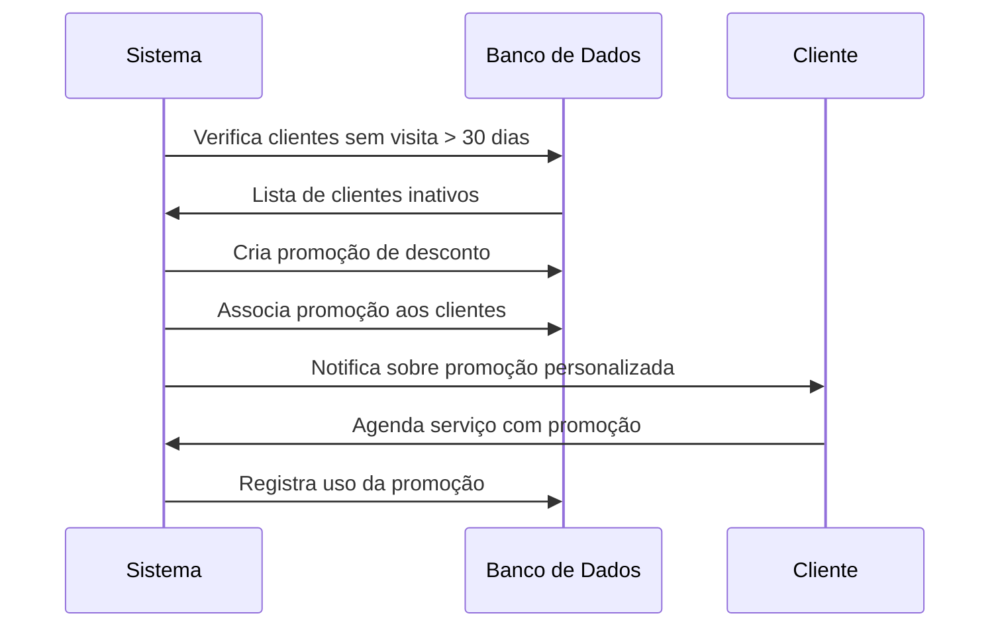

# 🎟️ Fluxos de Uso - Sistema de Vales e Fidelidade

Este documento explica os principais fluxos de uso do sistema de vales, promoções e fidelidade da barbearia.

## 📋 Fluxo 1: Cliente Acumula Cortes e Ganha Vale



### Código de Implementação

```typescript
// Função para registrar conclusão de serviço
async function completeService(appointmentId: string) {
  // 1. Buscar dados do agendamento
  const appointment = await prisma.appointment.findUnique({
    where: { id: appointmentId },
    include: { service: true, user: true }
  });
  
  // 2. Criar registro no histórico
  const history = await prisma.serviceHistory.create({
    data: {
      userId: appointment.userId,
      serviceId: appointment.serviceId,
      finalPrice: appointment.service.price,
      // outros campos relevantes
    }
  });
  
  // 3. Atualizar status do agendamento
  await prisma.appointment.update({
    where: { id: appointmentId },
    data: { 
      status: "COMPLETED",
      serviceHistoryId: history.id
    }
  });
  
  // 4. Verificar se o cliente atingiu 5 cortes
  const serviceCount = await prisma.serviceHistory.count({
    where: {
      userId: appointment.userId,
      serviceId: appointment.serviceId
    }
  });
  
  // 5. Se completou 5 serviços, criar voucher
  if (serviceCount % 5 === 0) {
    await prisma.voucher.create({
      data: {
        code: `FREE-${appointment.userId.substring(0, 5)}-${Date.now()}`,
        type: "FREE_SERVICE",
        value: appointment.service.price,
        minServices: 5,
        validUntil: new Date(Date.now() + 30 * 24 * 60 * 60 * 1000), // 30 dias
        status: "ACTIVE",
        userId: appointment.userId,
        serviceId: appointment.serviceId
      }
    });
    
    // Enviar notificação (implementação depende do sistema)
  }
}
```

## 📋 Fluxo 2: Cliente Usa Vale em Novo Agendamento



### Código de Implementação

```typescript
// Função para criar agendamento com vale
async function createAppointmentWithVoucher(
  userId: string,
  serviceId: string,
  barberId: string,
  date: Date,
  voucherId: string
) {
  // 1. Verificar se o voucher é válido
  const voucher = await prisma.voucher.findUnique({
    where: {
      id: voucherId,
      userId: userId,
      status: "ACTIVE",
      validUntil: { gte: new Date() }
    }
  });
  
  if (!voucher) {
    throw new Error("Vale inválido ou expirado");
  }
  
  // 2. Criar o agendamento com o vale
  const appointment = await prisma.appointment.create({
    data: {
      userId,
      serviceId,
      barberId,
      date,
      voucherId,
      status: "SCHEDULED"
    }
  });
  
  // 3. Marcar o vale como usado
  await prisma.voucher.update({
    where: { id: voucherId },
    data: { status: "USED" }
  });
  
  return appointment;
}
```

## 📋 Fluxo 3: Promoção Personalizada por Frequência



### Código de Implementação

```typescript
// Função para criar promoções para clientes inativos
async function createPromotionsForInactiveClients() {
  const thirtyDaysAgo = new Date();
  thirtyDaysAgo.setDate(thirtyDaysAgo.getDate() - 30);
  
  // 1. Encontrar clientes sem visitas nos últimos 30 dias
  const inactiveClients = await prisma.user.findMany({
    where: {
      role: "CLIENT",
      serviceHistory: {
        every: {
          completedAt: {
            lt: thirtyDaysAgo
          }
        }
      }
    }
  });
  
  // 2. Criar uma promoção de desconto
  const promotion = await prisma.promotion.create({
    data: {
      name: "Volta com 10% OFF",
      description: "10% de desconto para clientes que não visitam há mais de 30 dias",
      type: "DISCOUNT_PERCENTAGE",
      value: 10.00, // 10%
      validFrom: new Date(),
      validUntil: new Date(Date.now() + 15 * 24 * 60 * 60 * 1000), // 15 dias
      isGlobal: false,
      minFrequency: 30, // 30 dias sem visita
      active: true
    }
  });
  
  // 3. Associar a promoção aos clientes inativos
  for (const client of inactiveClients) {
    await prisma.userPromotion.create({
      data: {
        userId: client.id,
        promotionId: promotion.id
      }
    });
    
    // Enviar notificação (implementação depende do sistema)
  }
}
```

## 📝 Anotações de Estudo

- O sistema de fidelidade é baseado na contagem de serviços no histórico
- Vales têm status (ACTIVE, USED, EXPIRED) e data de validade
- Promoções podem ser globais ou personalizadas por usuário
- A lógica de negócio deve verificar condições antes de criar vales/promoções

## 🧪 Exercício Prático

**Desafio:** Implemente uma função que expire automaticamente vouchers vencidos.

**Solução:**
```typescript
async function expireOldVouchers() {
  const today = new Date();
  
  // Encontrar e atualizar vouchers vencidos
  const expiredVouchers = await prisma.voucher.updateMany({
    where: {
      status: "ACTIVE",
      validUntil: {
        lt: today
      }
    },
    data: {
      status: "EXPIRED"
    }
  });
  
  console.log(`${expiredVouchers.count} vouchers foram expirados.`);
  return expiredVouchers.count;
}
```